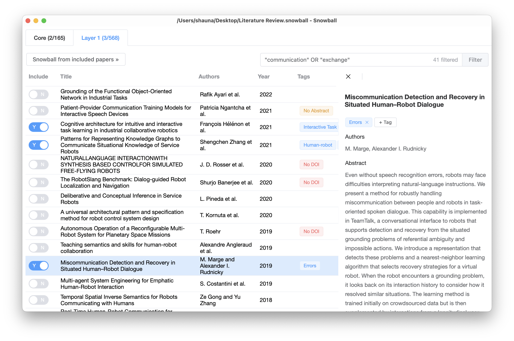

  
  

   
  

  <h1 align="center"><b>Snowball</b></h1>
  

  Find and filter literature, fast.
     
     
    <b>Download for </b>
    <a href="https://github.com/shaunabanana/snowball/releases/download/v1.2.1/snowball-1.2.1-universal-mac.zip">macOS</a>
    ·
    <a href="https://github.com/shaunabanana/snowball/releases/download/v1.2.1/snowball.Setup.1.2.1.exe">Windows</a>
    ·
    <a href="https://github.com/shaunabanana/snowball/releases/tag/v1.2.1">Linux</a>
     
  

Snowball lets you quickly find and filter through papers using the snowballing method. Start with a core collection of papers, and find more by going through their citations and references.
 
 

## How to use

1. Start with a collection of papers. You can use a search engine like Web of Science or a reference manager like Zotero.
2. Export your "core" collection into a BibTeX/RIS/... file. Import it into Snowball.
3. Review the papers according to you inclusion criteria. Assign tags and write notes as necessary.
4. Once you've decided on a paper, tick/untick the switch for inclusion/exclusion.
5. After going through the list, click "Snowball from included papers" to find all citations and references of the included papers.
6. Go to step 3, rinse and repeat.

## I found a bug!

Please file an issue [here](https://github.com/shaunabanana/snowball/issues), or email me at shengchenzhang1207@gmail.com.

## Support me

[爱发电](https://afdian.net/@shaunabanana)

